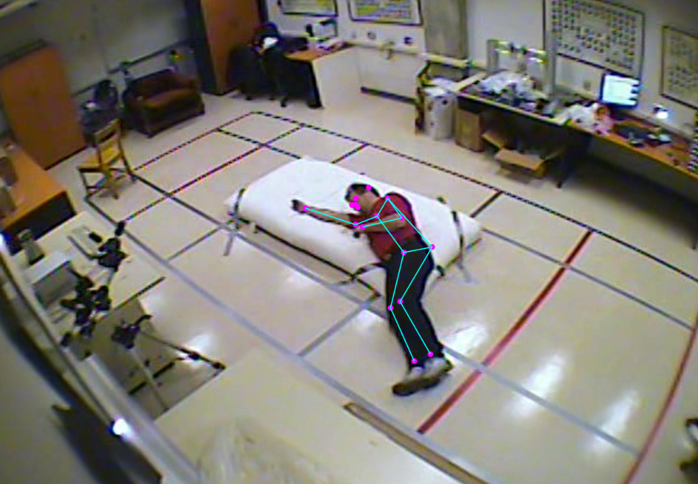

# Real Time Remote Fall Detection Using Deep Neural Networks
We present a pose estimation, Convolutional Neural Network (CNN) and Recurrent Neural Network (RNN) based fall detection method. Our RNN takes time series of 2D body poses as inputs.
Each pose is made of 34 numerical values which represent the 2D coordinates of 17 body keypoints and is obtained using a combination of PoseNet and a CNN on RGB videos. Each series is classified as containing a fall or not.  The proposed method can be configured to be suitable for real-time usage even on low-end machines. Furthermore, the proposed architecture can run completely inside the web browser, making it possible to use it without a dedicated software or hardware. As no data is exchanged with external servers, the proposed system preserves user privacy. Our implementation focuses on the detection of a single individual's fall in a controlled environment, such as an elderly person who lives alone or does not have continuous assistance.

The paper has been accepted for publication at CARE2020 ICPR's Workshop. Check out the [Video Presentation](http://phuselab.di.unimi.it/CARE2020/program.html) on CARE2020  website.

# Citation
If you use any part of this code in your research, please cite our paper:

<pre>
@INPROCEEDINS {,  
    author    = {Andrea Apicella and Lauro Snidaro},
    title     = {Deep Neural Networks for real-time remote fall detection},
    booktitle = {Proceedings of the CARE 2020 workshop},
    year      = {2021},
    month     = {jan}
  }
</pre>

